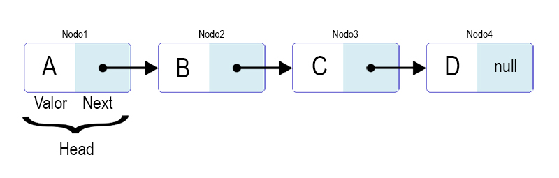
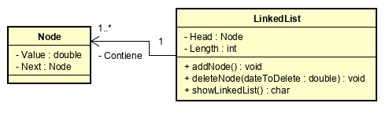

## Cálculo de la media y desviación estándar usando Linked List 

En este repositorio, se implementó una linkedList en la que se guardan datos obtenidos de archivos externos.





La linkedList está conformada por nodos, de los cuales el primero es la cabeza (head). Cada nodo tiene un dato o valor, y un nodo al que vincula o hace enlace. Se puede determinar el fin de la linkedList, encontrando el nodo que tiene nulo al nodo que enlaza.

___
### Insignias

[](https://www.codacy.com/app/acai-bjca/Ejercicio-1-AREP?utm_source=github.com&amp;utm_medium=referral&amp;utm_content=acai-bjca/Ejercicio-1-AREP&amp;utm_campaign=Badge_Grade)

___
### Uso del proyecto como librería
Si desea usar éste repositorio como librería en su proyecto, realice los siguientes pasos:

• Descargue o clone él repositorio Ejercicio-1-AREP: <https://github.com/acai-bjca/Ejercicio-1-AREP.git>
• Agregue la siguiente dependencia al pom de su proyecto:
 <dependency>
    <groupId>edu.eci</groupId>
	<artifactId>Ejercicio-1-ARE</artifactId>
	<version>1.0-SNAPSHOT</version>
</dependency>
• Importe el proyecto en la clase que lo requiera:
import edu.escuelaing.arep.*;

___
### Ejecutando las pruebas

Para ejecutar las pruebas puede usar el comando:
>mvn package

Adicionalmente, en la clase 'Ejercicio' (en el método principal), puede modificar el nombre del archivo y ejecutar el programa.
___
### Desglose en pruebas
En la carpeta src test hay dos archivos de pruebas (src\test\java\edu\escuelaing\arep\).  
• LinkedListTest tiene pruebas que verifican las operaciones de la clase LinkedList. Como lo son agregar y eliminar un nodo correctamente, ando el dato.
• AppTest  tiene pruebas que verifican el correcto funcionamiento de las operaciones del ejercicio como tal, es decir la lectura de archivos con el cálculo de la media y la desviación estándar de los datos leídos. Los archivos que contienen los datos están en la carpeta resources.

Por ejemplo:

```java
public void testDeberiaLeerLosArchivosYGenerarRespuestasCorrectas() throws IOException
    {
        String url = "src/main/resources/datos.txt";       
        Ejercicio ejercicio = new Ejercicio();
        LinkedList linkedList = ejercicio.readData(url);
        Double expectedMean = 550.6 ;
        Double expectedStandardDeviation = 572.03 ;
        Double mean = calculateMean(linkedList);
        assertEquals(expectedMean, mean, 10);
        
        Double generateStandardDeviation = ejercicio.calculateStandardDeviation(linkedList);
        assertEquals(expectedStandardDeviation, generateStandardDeviation, 10);
```
En esta prueba, después de leer los datos que están en el archivo "datos.txt", realiza los cálculos para después compararlos con los resultados esperados.

Las pruebas las puede comprobar con el comando:
>mvn compile

Si lo desea, en la clase 'Ejercicio' (método principal), puede modificar el nombre del archivo y ejecutar el programa.

___
### Construido con

• Java  
• [Maven] (https://maven.apache.org/) - Gestión de dependencias

___
### Autor

**Amalia Inés Alfonso Campuzano** 

Estudiante de la Escuela Colombiana de Ingeniería Julio Garavito

Ingeniería de Sistemas
___
### Licencia

Este proyecto está licenciado bajo la Licencia GNU - vea el archivo [LICENSE.md] (LICENSE.md) para más detalles.
